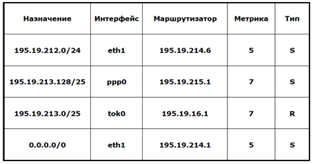

# 16. Статическая маршрутизация. Таблицы маршрутизации.

**Статическая маршрутизация** – вид маршрутизации, при котором маршруты указываются в явном виде при конфигурации маршрутизатора администратором. Вся маршрутизация при этом происходит без участия каких-либо протоколов маршрутизации. Статический маршрут хранится в таблицах до выключения. 

При задании статического маршрута указывается:

- Адрес сети (на которую маршрутизируется трафик), маска сети
- Адрес шлюза (узла), который отвечает за дальнейшую маршрутизацию (или подключен к маршрутизируемой сети напрямую)
- (опционально) метрика ("цена") маршрута.

## Достоинства:

- Лёгкость отладки и конфигурирования в малых сетях
- Отсутствие дополнительных накладных расходов (из-за отсутствия протоколов маршрутизации)
- Мгновенная готовность (не требуется интервал для конфигурирования/подстройки)
- Низкая нагрузка на процессор маршрутизатора
- Предсказуемость в каждый момент времени

## Недостатки:

- Очень плохое масштабирование
- Низкая устойчивость к повреждениям линий связи
- Отсутствие динамического балансирования нагрузки
- Необходимость в ведении отдельной документации к маршрутам

В реальных условиях статическая маршрутизация используется в условиях наличия шлюза по умолчанию (узла, обладающего связностью с остальными узлами) и 1-2 сетями.

## Таблицы маршрутизации

Атрибуты маршрутных записей:

- Сеть/узел назначения
- Сетевой интерфейс
- Маршрутизатор
- Метрика маршрута
- Флаги

**Псевдомаршруты** – дополнительные записи в таблице маршрутизации, которые используются для унификации процедуры поиска маршрута. Типы:

- Псевдомаршрут на IP-адреса собственных интерфейсов
- Псевдомаршрут на подключенные IP-сети

**Маршрут «по умолчанию»** – специальный маршрут, которые используется в случае отсутствия явных маршрутов на целевую сеть, обозначение: 0.0.0.0/0.0.0.0

Утилита route предназначена для просмотра и управления таблицей маршрутизации.

В некоторых системах поддерживается несколько таблиц маршрутизации, в таких таблицах используется коммутация **по адресу источника** – в зависимости от адреса источника выбирается подчиненная таблица маршрутизации.

# 50. Архитектура IPv6. Переход от IPv4 к IPv6.

Предпосылки развития связаны с недостатками протокола IPv4:

- Малое адресное пространство (32-битная адресация -> 232 = 4294967296 адресов)
- Неудобный формат адреса
- Сложная маршрутизация
- Низкая защищенность
  - Отсутствие шифрования
  - Отсутствие аутентификации
- Низкая эффективность передачи

## Сосуществование стеков

В 1995 году, когда вышел RFC на IPv6, было сказано, что в 2000 году IPv4 не останется, все перейдут на IPv6. Потом сказали, что к 2000 году не удалось, перейдем к 2005, потом к 2010, к 2015, к 2020. Сейчас есть оптимистичный прогноз на 2025 год, но в отличие от всех предыдущих случаев уже сейчас, примерно с 2015 года вся инфраструктура сети Интернет уже готова к переходу на IPv6, все маршрутизаторы поддерживают IPv6, все программные маршрутизаторы поддерживают, все ОС имеют стек протоколов IPv6. И сейчас вопрос перехода не технический, а организационный.

Как происходит сейчас переход на IPv6 (а уже существенная часть сети перешла на IPv6)? Есть несколько способов:

- **Двойные стеки протоколов:** компьютере поднимаются оба стека протоколов и часть приложений привязывается к стеку протоколов IPv4, а часть к IPv6)
- **Туннелирование:** вид маршрутизации, когда трафик одного типа запаковывается в трафик другого типа (используется в VPN). Островки сети IPv6 туннелируются сквозь сети IPv4 через программные туннели и для узлов IPv6 это прозрачно, потому что туннели — это прозрачная технология для прикладных программ.

- **Трансляция адресов:** когда пакет из сети IPv6 пришел на границу сети и дальше идут сети IPv4, то происходит трансляция одного адреса в другой.

 

 