# 5. Архитектура сетей ТСP/IP. Протокол IP.

**IP – Internet Protocol** – межсетевой протокол. Нужен, чтобы объединить разные сети, использующие разные технологии передачи данных. IP – основной протокол, использующийся в Интернете.

В модели ISO/OSI расположен на Сетевом уровне

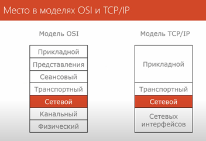

В модели TCP/IP расположен на Сетевом уровне

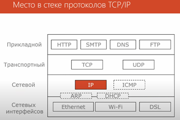

IP передает данные без установления соединения. IP обеспечивает передачу данных без гарантии доставки и без сохранения порядка следования сообщений

IP просто посылает пакет в сеть. Если пакет не дошел, то IP никак об этом не оповещает и не пытается заново отправить недошедший пакет. Такие ошибки должны быть исправлены протоколами на вышестоящих уровнях

**Задачи IP:**

- **объединение сетей** с разными технологиями в одну крупную сеть
- **маршрутизация**. поиск маршрута от отправителя к получателю
- качество обслуживания

## Формат пакета:

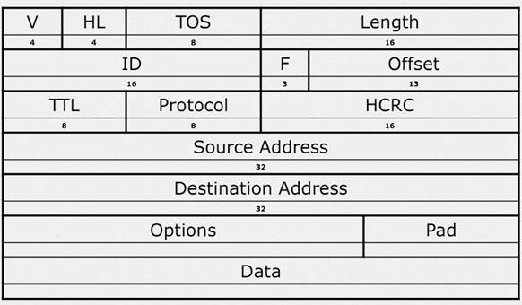

- **Version** - Версия протокола. Текущая версия 4 (0100).
- **Header Length** - Количество 32 битных слов в заголовке пакета. Минимальная размер заголовка 20 байт, то есть в Header Length = 0x5. Наличие информации в поле Options может увеличить размер заголовка максимум на 4 байта. Если это поле заполнено не полностью, то заполненные биты покрываются 32 битными словами и незаполненная часть заполняется нулями. 
- **Type of Service** - Желаемое качество обслуживания пакета при его доставке.
- **Total Length** - Общая длина IP пакета.
- **Identifier** - Идентификатор пакета. Если пакет фрагментирован, то все фрагменты имеют одинаковый идентификатор. Это необходимо для восстановления исходного пакета.
- **Fragmentation Flags** - Флаги фрагментации. В настоящее время используется только два бита. Один показывает, фрагментирован пакет или нет, второй говорит о наличии фрагментов, следующих за текущим.
- **Fragment Offset** - Позиция фрагмента внутри пакета. Если пакет не фрагментирован то 0x0.
- **Time to Live** - количество раз, которое пакет может пройти через маршрутизаторы. При прохождении через маршрутизатор, TTL уменьшается на 1. При TTL = 0 пакет уничтожается. Такой механизм помогает, если пакет попал в "петлю". Чтобы сеть со временем не перегрузилась пакетами, они сами уничтожаются когда TTL достигает 0. 
- **Protocol** - Тип транспортного протокола, используемого при передаче (TCP или UDP)
- **Header** **Checksum** - Контрольная сумма.
- **Source** **Address** - Идентификатор отправителя пакета.
- **Destination Address** - Идентификатор получателя пакета.
- **Options and Padding** - Переменное число 32 битных слов (максимум 4 байта) используются для дополнительной информации о пакете.

# 6. Связь c канальным уровнем в ТСP/IP. Протокол разрешения адреса ARP.

ARP – Address Resolution Protocol – протокол разрешения адресов

Нужен для определения MAC-адреса устройства по его IP-адресу

Для определения MAC-адреса использует схему ARP-запрос – ARP-ответ

Алгоритм:

1. Компьютер, который хочет узнать MAC-адрес определенного компьютера в сети посылает **широковещательный** ARP-запрос на все компьютеры в сети с вопросом «У кого IP 192.168.10.43?»

2. Компьютер с IP адресом = 192.168.10.43, отправляет ARP-ответ со своим MAC-адресом

3. Компьютер-отправитель получает ARP-ответ, вытаскивает из него MAC-адрес и использует его для дальнейшей передачи данных по сети

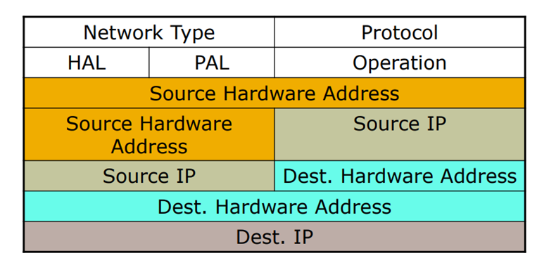

- Network Type – тип канального протокола. Ethernet = 1 
- Protocol - протокол сетевого уровня. IP = 2048 
- HAL - длина канального адреса 
- PAL - длина сетевого адреса
- Operation - тип операции. 1 = запрос. 2 = ответ.
- Source Hardware Address - MAC адрес отправителя
- Source IP Address - IP адрес отправителя
- Dest. Hardware Address - MAC адрес получателя
- Dest. IP Address - IP адрес получателя

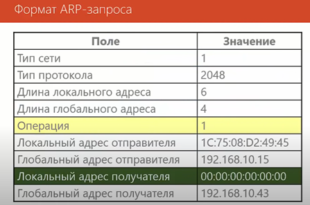

# 8. Управляющий протокол ICMP. Сигнализирующие сообщения.

## Общие сведения

- Протокол сетевого уровня;
- Решает задачи 
  - управления,
  - нотификации об ошибках, 
  - тестирования и мониторинга;
- Инкапсулируется в IP *(да, протокол сетевого уровня в протоколе сетевого уровня)*;
- Описан в RFC792.

Задачи управления и нотификации – базовые функции сетевого уровня. При этом авторы архитектуры не зашили это в протокол IP, а выделили в отдельный протокол. Один из важнейших для стека TCP/IP.

ICMP-трафик обычно не пускают на широковещательные адреса.

## Организация протокола ICMP

Общая часть заголовка *(8, 8, 16 бит)*:

- Тип – тип пакета;
- Код – расшифровка типа (подтип);
- Контрольная сумма вычисляется для всего пакета.

Остальная часть пакета зависит от типа ICMP-пакета.

## Нотификационные (сигнализирующие) сообщения

Информируют отправителя о каком-либо событии в сети.

***Нотификационные сообщения фильтровать нельзя!***

### Основные типы:

- 3 – получатель недостижим *(нельзя фильтровать в своей сети)*: 
  - Тип (3);
  - Код *(причина «недостижимости»)*:
    - 0 – сеть недостижима;
    - 1 – узел недостижим;
    - 2 – протокол недостижим *(например, хотим доставить по* *TCP, но приемная сторона его не поддерживает)*;
    - 3 – порт недостижим *(когда никто {сервис, приложение} не прослушивает порт)*;
    - 4 – требуется фрагментация *(в* *IP-пакете установлен флаг, запрещающий фрагментацию, но сам пакет слишком большой для передачи целиком по каналу)*;
    - 5 – ошибка маршрутизации от источника *(когда не можем строго пройти через указанные адреса {строгая маршрутизация от источника в* *IP})*;
    - 6 – сеть назначения неизвестна *(обычно – попытки маршрутизации в сеть класса Е, то есть в адреса, которые не маршрутизируются в сетях* *TCP/**IP)*;
    - 7 – узел назначения неизвестен *(c**м. 6)*;
    - 8 – отправитель изолирован *(обычно – нет действующих интерфейсов для отправки пакета)*;
    - 9 – взаимодействие с сетью назначения административно запрещено *(фаервол – стоит правило* *REJECT {а вообще есть* *accept,* *deny,* *reject, но обычно во избежание перегрузки сети ответными пакетами ставят* *DENY и молча отбрасывают пакеты})*;
    - 10 – взаимодействие с узлом назначения административно запрещено *(см 9)*.
    - 11 – сеть недостижима из-за класса обслуживания *(используются разряды* *TOS, на всех маршрутизаторах внутри сети настроено управление качеством обслуживания, а мы запросили сервис выше нашего уровня)*;
    - 12 – узел недостижим из-за класса обслуживания *(см. 11)*.
  - Контрольная сумма;
  - Нулевое слово;
  - Заголовок и первые два слова пакета *(который не смогли доставить)*;
- 11 – превышено время *(нельзя фильтровать в своей сети)*: 
  - Тип (11);
  - Код:
    - 0 – превышено TTL;
    - 1 – превышено время ожидания фрагмента при сборке;
  - Последнее поле содержит первую часть пакета, фрагмент которого не дошел;
- 12 – ошибка параметра *(нельзя фильтровать в своей сети)*: 
  - Тип (12);
  - Указатель (байтовый). *(В случае, если какой-либо из промежуточных маршрутизаторов или конечный узел, проанализировав заголовок* *IP-пакета, определил, что произошла ошибка {невалидное значение поля, неверная контрольная сумма…}, он сообщает о ней, указывая номер ошибочного байта)*;
  - Последнее поле содержит первую часть пакета, в котором обнаружена ошибка;

# 9. Управляющий протокол ICMP. Управляющие и тестовые сообщения

*(!TODO)*

**Общие сведения ICMP** – 8 вопрос 

## Управляющие сообщения

Управляющие сообщения – попытка «повлиять» на саму сеть.

### Основные типы:

- 4 – подавление источника *(не синхронизирована скорость передачи данных между передатчиком и приемником. Если передатчик слишком быстро передает пакеты, приемная сторона передает следующий пакет. Передающая сторона по умолчанию снижает скорость передачи в 2 раза. Фильтровать нежелательно)*:
   
  - Тип (4);
  - Последнее поле содержит первую часть пакета, поток которого необходимо замедлить;
- 5 – изменение маршрута *(если пакет с точки зрения маршрутизатора отправляется неоптимальным путем. Отправляет ответ отправителю в качестве совета по перемаршрутизауции)*:
   
   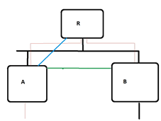
   *Легко подделывается. С начала 2000-х фильтруется во всех ОС. По возможности такие пакеты убиваются на всех маршрутизаторах!
   Проблемы:*
   *Функция маршрутизации реализуется протоколами маршрутизации, а не* *ICMP-протоколом (управляющим). Невозможно проконтролировать, кто создал пакет и валидный ли он.*
  - Тип (5);
  - Код *(тип переназначения маршрута)*:
    - 0 – для всей сети,
    - 1 – для узла,
    - 2 – для типа сервиса и сети,
    - 3 – для типа сервиса и узла;
  - IP-адрес маршрутизатора, *куда* необходимо присылать пакеты;
  - Заголовок IP-пакета, который (с точки зрения маршрутизатора-отправителя) идет неоптимальным путем).

## Тестовые и контрольные сообщения

Позволяют проводить диагностику сети.

Обычно идут парами «запрос-ответ».

### Типы:

- Запрос эха (8) и ответ на запрос эха (0) *(**ping и* *pong. Проверка работоспособности удаленного узла. Используется в утилитах типа* *ping и ей подобных, позволяющих проверить достижимость узла в сети)*:
   
   Идея: станция посылает удаленной станции пакет с типом 8, промежуточные маршрутизаторы доводят его до последней станции. Та, получив его, уничтожает, в ответ формирует такой же пакет с типом 0, а в поле данных копирует те необязательные данные, которые были в поле эхо-запроса, после чего посылает обратно.
   *Обычно в своей сети разрешаем 8 на выход и 0 на вход. Остальное отрубаем. Иногда – ставим прокси (**ICMP-сервер), чтобы он формировал фейковые сообщения за все компьютеры в сети.*

  - Тип (8 или 0);
  - Идентификатор *(для различения пар потоков* *ping-ов и* *pong-ов. По нему определяется процесс, которому отдают ответный трафик)*;
  - Последовательный номер *(номер пакета в серии. Для посылки не одного, а нескольких пакетов. Для сопоставления ответа запросу)*;
  - Необязательные данные *(тестирование на прохождение пакетов данных определенного размера по каналу связи. Могут расширить* *ICMP-пакет до 64 Кб. Большие пакеты могут фильтроваться по размеру из-за имевшей место атаки «**ping* *of* *death»)*;

- Запрос временной метки (13) и ответ на запрос временной метки (14):
   
   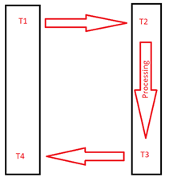
   *(позволяют определить временные параметры функционирования сети)*

  - Идентификатор – номер потока сообщений;
  - Последовательный номер – номер пакета в потоке;
  - (T1) **Временная метка отправителя** заполняется источником *(время, когда пакет улетел из отправителя)*;
  - (T2) **Временная метка приема** фиксируется при получении запроса приемником *(время, когда пакет пришел на приемную станцию)*;
  - (T3) **Временная метка передачи** заполняется приемником *(когда был послан ответ)*;
  - (T4) Еще мы знаем время, когда мы получим ответ обратно от приемника;
  - Проблемы:
    - Синхронизация часов;
    - Фильтрация.

- Запрос маски адреса (17) и ответ на запрос маски адреса (18):
   
   *(Чаще всего – чтобы узнать топологию удаленной сети. Считается опасным, не рекомендуется к использованию вне текущей сети)*.

  - Идентификатор – номер потока сообщений;

  - Последовательный номер – номер пакета в потоке;

  - Маска – записанная маска адреса приемника.

# 10. Адресация приложений. Понятие портов.

## Понятие портов

- Порт – уникальный номер приложения на узле, использующего конкретный транспортный протокол
- В TCP/IP порт – 16 разрядов (0...65535)
- Приложение идентифицируется сокетом:
  - IP-адресом узла
  - Типом транспортного протокола
  - Номером порта
- Примеры:
  - TCP-сокет: 195.19.212.13:80
  - UDP-сокет: 195.19.212.10:53
- Есть некоторые правила по умолчанию, которые все стараются соблюдать: 
  - Сервер обычно использует фиксированные номера портов из диапазона от 0 до 1023.
  - Клиент обычно использует непривилегированные номера портов из диапазона 1024+. В некоторых ОС для того, чтобы выдать приложению порт меньше 1024, требуется, чтобы приложение имело достаточно привилегий и прав. 
- Философия, которую пыталась сделать IANA, а теперь ICANN: 
  - 1024 адреса – это зарезервированные адреса, которые мы выдаём всем известным сервисам, а то, что выше 1024 – это свободно распространяемые номера портов.
  - Для сервера важно иметь предопределённый номер, потому что мы должны из разных узлов должны к нему обращаться и знать его номер, нам важно, чтобы он был фиксированный и публичный. А для клиента неважно, чтобы его номер был фиксированный, потому что к клиенту никто напрямую не обращается за редким исключением. Поэтому адрес клиента не должен быть публичным, его можно выдавать временно на 1 сеанс, что и сделано в большинстве протоколов.

# 15. Маршрутизация в TCP/IP. Маршрутизаторы и шлюзы. Процесс доставки пакетов в сети.

### Маршрутизация

- Функция сетевого уровня
  - Заключается в доставке пакетов через сеть от одного узла к другому
  - Маршрутизация:
- Индивидуальная
- Групповая
- В TCP/IP сетях маршрутизация является частью протокола IP (Internet Protocol) и используется в сочетании с другими службами сетевых протоколов для обеспечения передачи данных между узлами, расположенными в разных сегментах более крупной TCP/IP-сети.

### Маршрутизаторы и шлюзы

- Другие названия:
  - Шлюз
  - Router
  - Gateway
- Устройство сетевого уровня, реализующее функции маршрутизации (обеспечивающее доставку пакетов от одного узла сети к другим)
- Отличие маршрутизатора от обычного сетевого узла – пересылка входящих пакетов, у которых адрес назначения не совпадает с локальными адресами узла
- IP-forwarding. Переадресация IP, также известная как интернет-маршрутизация, представляет собой процесс, используемый для определения того, по какому пути может быть отправлен пакет или дейтаграмма. Процесс использует информацию о маршрутизации для принятия решений и предназначен для отправки пакета по нескольким сетям.
- Виды маршрутизаторов:
  - Аппаратные (маршрутизатор, router)
  - Программно-аппаратные (шлюз, gateway)

### Аппаратные маршрутизаторы (маршрутизатор)

- Особенности:

  - Поддержка различных канальных сред
  - Наличие нескольких сетевых интерфейсов
  - Высокая производительность
  - Высокая надежность
  - Хорошая защищенность
  - Дополнительные функции:
    - Фильтрация
    - Трансляция адресов
    - Сбор статистики

  - Обычно высокая стоимость

- Производители:
  - CISCO
  - Intel
  - HP
  - Dlink

### Программно-аппаратные маршрутизаторы (шлюз)

- Реализуются функциями ОС общего назначения
- Характеризуются
  - Невысокой производительностью
  - Невысокой стоимостью
  - Могут совмещать функции с обычными функциями ОС

## Процесс маршрутизации

В процессе маршрутизации на стороне отправителя данные проходят все 7 уровней модели ISO/OSI сверху-вниз постепенно инкапсулируясь на каждом из уровней. В итоге получается такой большой «конверт с конвертами», который пересылается получателю. На стороне получателя данные постепенно декапсулируются («конверт» постепенно раскрывается) на каждом уровне, пока идут снизу-вверх и пока не достигнут прикладного уровня.

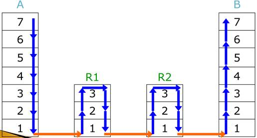

- A, B – компьютеры
- R1, R2 – маршрутизаторы
- 1–7 – это уровни в OSI/ISO
- Компьютер использует все 7 уровней модели, а маршрутизатор только 3, так как их достаточно, чтобы продолжить маршрут в любой сети.

# 16. Статическая маршрутизация. Таблицы маршрутизации.

**Статическая маршрутизация** – вид маршрутизации, при котором маршруты указываются в явном виде при конфигурации маршрутизатора администратором. Вся маршрутизация при этом происходит без участия каких-либо протоколов маршрутизации. Статический маршрут хранится в таблицах до выключения. 

При задании статического маршрута указывается:

- Адрес сети (на которую маршрутизируется трафик), маска сети
- Адрес шлюза (узла), который отвечает за дальнейшую маршрутизацию (или подключен к маршрутизируемой сети напрямую)
- (опционально) метрика ("цена") маршрута.

## Достоинства:

- Лёгкость отладки и конфигурирования в малых сетях
- Отсутствие дополнительных накладных расходов (из-за отсутствия протоколов маршрутизации)
- Мгновенная готовность (не требуется интервал для конфигурирования/подстройки)
- Низкая нагрузка на процессор маршрутизатора
- Предсказуемость в каждый момент времени

## Недостатки:

- Очень плохое масштабирование
- Низкая устойчивость к повреждениям линий связи
- Отсутствие динамического балансирования нагрузки
- Необходимость в ведении отдельной документации к маршрутам

В реальных условиях статическая маршрутизация используется в условиях наличия шлюза по умолчанию (узла, обладающего связностью с остальными узлами) и 1-2 сетями.

## Таблицы маршрутизации

Атрибуты маршрутных записей:

- Сеть/узел назначения
- Сетевой интерфейс
- Маршрутизатор
- Метрика маршрута
- Флаги

**Псевдомаршруты** – дополнительные записи в таблице маршрутизации, которые используются для унификации процедуры поиска маршрута. Типы:

- Псевдомаршрут на IP-адреса собственных интерфейсов
- Псевдомаршрут на подключенные IP-сети

**Маршрут «по умолчанию»** – специальный маршрут, которые используется в случае отсутствия явных маршрутов на целевую сеть, обозначение: 0.0.0.0/0.0.0.0

Утилита route предназначена для просмотра и управления таблицей маршрутизации.

В некоторых системах поддерживается несколько таблиц маршрутизации, в таких таблицах используется коммутация **по адресу источника** – в зависимости от адреса источника выбирается подчиненная таблица маршрутизации.

# 27. Архитектура ДНС. Прямой поиск.

#### Архитектура:

DNS (domain name system) - распределённая иерархическая система, чаще всего используется для преобразования доменного имени в IP-адрес или для обеспечения работы почтовой системы.

**Структура:**

- Вся система имеет древовидную структуру, корневой элемент которой - ".", обслуживается 13 серверами (обозначаются буквами a-m) или зеркалами этих серверов (в РФ нет корневых серверов, только зеркала).
- Всё дерево имён поделено на участки ответственности - "зоны", каждая из которых обслуживается своим сервером. 
- Сервер, который ответственен за данную зону, называется авторитетным.
- DNS-клиент всегда обращается к серверу через resolver

Для каждой зоны должно быть несколько авторитетных серверов, находящихся в разных подсетях (для надёжности):

- Первичный (один)
  - содержит оригинал информации о подконтрольной зоне (e.g. в локальной сети)
- Вторичный (несколько) 
  - содержит копии информации о подконтрольной зоне (e.g. арендованный у хостинга, у провайдера)
  - периодически обновляет информацию
  - в конфигурации вторичного сервера указывается, что делать, если первичный не отвечает

**По способу ответа DNS-серверы бывают:**

- Рекурсивные
  - САМИ выполняют всю процедуру поиска
  - Кэшируют полученный результат
- Нерекурсивные
  - Перенаправляют на сервер с необходимой информацией
  - Не занимаются кэшированием

Стоит учесть, что рекурсивный поиск - долгая и более ресурсозатратная процедура, поэтому чем "выше" мы поднимаемся, тем меньшая вероятность встретить рекурсивный сервер. Все корневые серверы (".") и все домены 1 уровня - нерекурсивные.

### **Прямой поиск:**

Пример: мы (office.school.server.ru) хотим обратиться к сайту (www.support.ibm.com). Тогда первое (некэшированное) обращение будет выглядеть следующим образом:

- Resolver на нашем компьютере обращается к сохранённому в конфигурации TCP/IP DNS-серверу
  - DNS-серверы по умолчанию имеют префикс ns, допустим, наш сохранённый - ns.school.server.ru
- ns.school.server.ru - рекурсивный. Первый его запрос - к корневому серверу ("." - e.g. a.root-servers.net)
- Корневой сервер нерекурсивен - он перенаправит нас на сервер, ответственный за домен "com"
- Обращаемся к домену "com" - он нерекурсивен, отправит нас на сервер, ответственный за ibm.com (ns.ibm.com)
- ns.ibm.com - рекурсивный - сам обращается к DNS-серверу зоны support.ibm.com (ns.support.ibm.com)
- www - последний уровень домена - ns.support.ibm.com возвращает информацию на ns.ibm.com, попутно её кэшируя
- ns.ibm.com возвращает информацию на ns.school.server.ru, попутно её кэшируя
- ns.school.server.ru возвращает информацию нам, попутно её кэшируя

При последующем обращении по тому же адресу (пока не истекло время жизни кэшированной записи) ns.school.server.ru будет сразу возвращать нам требуемый адрес. При обращении по тому же адресу после истечения времени жизни записи вся процедура будет повторена снова.

# 28. База данных DNS. Ресурсные записи DNS. Адресные записи, записи о сервере имен.

База данных DNS состоит из отдельных ресурсных записей (Resource record - RR), каждая из которых хранит определённый тип информации.
**Записи имеют следующие поля:**

- Имя
  - При неуказанном имени будет использовано предыдущее
- Класс записи (почти всегда IN - internet)
- Тип записи
  - Основные типы: A, AAAA, NS, MX, etc.
- Время актуальности
  - Время, которое запись может храниться в кэше
  - При отсутствии - значение по умолчанию 
- Параметры записи
  - Зависят от типа записи
    - При описании часто используется формат BIND
    - A: Доменное имя узла, адрес узла
      - school IN A 195.19.212.16  на сервере ns.server.ru -> school.server.ru по адресу 195.19.212.16
    - NS: Имя домена, адрес сервера имён
      - school.server.ru. IN NS 195.19.212.13 -> скорее всего, вторичный name-server для домена server.ru.

# 29. База данных DNS. Главная ресурсная запись. Маршрутизация электронной почты.

**База данных DNS** состоит из ресурсных записей – записи помогают выполнять запросы. Ресурсные записи хранят определенный тип информации, каждая запись содержит определенное количество полей.

Главная ресурсная запись **SOA** (start of authority). Предназначена для описания параметров домена. Имеет много параметров, так как является неким *паспортом* домена:

- **Имя домена** – имя домена, для которого сформирована главная запись
- **Имя первичного DNS-сервера** – сервер, который отвечает за адрес домена
- **Почтовый адрес администратора** – связь при проблемах
- **Серийный номер зоны (Serial)** – уникальный ID текущей зоны, увеличивается при изменении зоны
- **Период обновления(Refresh)** – время в секундах, как часто вторичный сервер должен обращаться к первичному
- **Время валидности данных(Expire)** – если первичный сервер не отвечает, Expire отвечает на запросы о зоне информации
- **Период повторных попыток (Retry)** - указывает задержку перед следующим обращением после неудачной попытки
- **Значение по умолчанию (DefaultTTL)** - Время жизни для всех записей в зоне

Главная ресурсная запись одна на зону.

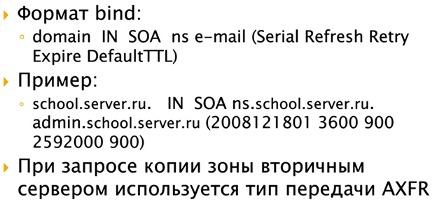

AXFR – копируется вся зона.

## Запись о сервере эл.почты

- DNS используется для маршрутизации почты
- Почтовый домен не всегда связан с конкретным IP адресом.
- MX связывает IP- адреса и почтовые домены
- Приоритет задает желаемое качество доставки.

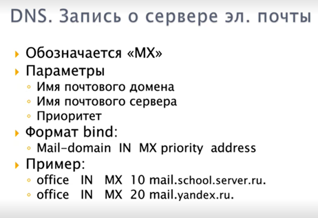

# 30 База данных DNS. Записи о псевдонимах, сервисах.

**Запись о псевдониме** – позволяет выдать новое имя уже известному адресу.

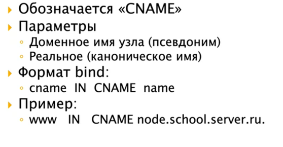

В реальном мире мало веб-серверов с именем www, практически всегда используется псевдоним. В конце 90-х появились веб-хостинги, в этом случае псевдоним используется как переключатель, что позволяет на одном физическом IP разместить неограниченное количество виртуальных адресов. Web-server узнает, к которому узлу обращаться благодаря особенностям http (URL хранится в заголовке http).

НЕ ИСОЛЬЗУЮТСЯ ДЛЯ МАРШРУТИЗАЦИИ ПОЧТЫ

## Запись о сервисе

Запись анонсирует наличие сервиса и его местонахождение. Запись о сервисе – относительно новая запись, расширяет идею MX, делает универсальным обращение к какой-либо службе. Вес используется чтобы распределять нагрузку между сервисами.

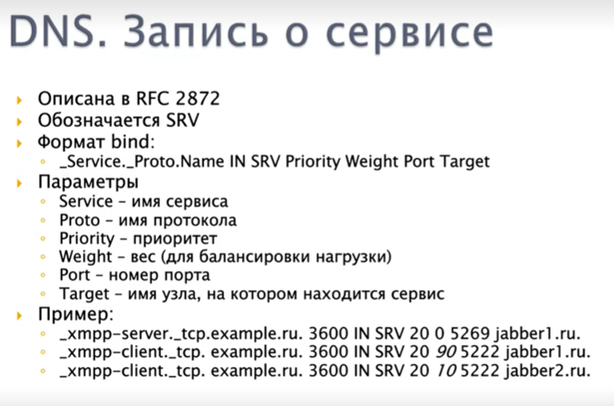

# 32. DNS. Динамические обновления; нотификации об изменениях; инкрементальные обновления.

## Динамические обновления:

**Причина появления:** наличие динамических систем управления адресами DHCP

DNS Dynamic Update – RFC 2136

Позволяет внешним авторизованным источникам менять адреса.

**Принцип работы:** Авторизованный клиент посылает DNS серверу запрос об изменении информации о ресурсной записи. Если сервер не первичен, то запрос пересылается наверх. Когда дошли до первичного DNS, то первичный сервер модифицирует свою базу данных, изменяет серийный номер зоны. Через какое то время вторичные серверы получают от первичного обновленную информацию.

## Нотификация об изменениях:

Асинхронное информирование об изменении информации.

Раньше вторичные серверы получали информацию от первичных синхронно, то есть, в соответствии с записью зоны синхронно получали обновление. Это не всегда удобно, хотелось бы получать уведомления об изменениях, данных от первичного сервера как можно раньше. Например, в случае динамических обновлений, надо чтобы эту информацию быстро узнал интернет.

DNS Notify – RFC 1996

Если включена эта опция, то первичный сервер посылает обновление всем известным ему вторичным серверам. Далее вторичные посылают другим вторичным. Каждое сообщение об нотификации подтверждается. Когда дошли «до конца» , вторичные серверы осуществляют запрос зоны как при периодическом обновлении.

## Инкрементальная передача зон (инкрементальные обновления):

Классический DNS передавал всю зону. То есть если что-то изменилось, то первичный передаёт вторичному весь огромный файл зоны, сколько бы там записей не было. При динамических обновлениях происходит слишком много трансферов зон.

Для уменьшения передаваемой информации, передаётся только инкремента (приращение) зоны, вместо всей зоны. В запросе вторичный указывает серийный номер зоны, которая у него есть, а первичный вычисляет разницу содержимого и высылает её.

Тип запроса изменяется на **IXFR**.

# 33. Автоматизированная настройка параметров. Протоколы BOOTP и DHCP.

## Управление сетевыми параметрами.

Два подхода:

1) Ручная настройка: вручную задаются IP адреса, маски, DNS серверы и прочие маршрутизаторы.

2) Автоматизированная настройка: перечисленные выше параметры настраиваются автоматически либо автоматизировано.

Идея автоматизированной настройки пришла от того, что когда имеется большая компьютерная сеть, то снабжать всех пользователей инструкцией как и что надо настроить, для администратора становится очень сложно. Тем более при изменении, какого либо параметра придется объяснять ещё раз. Появилась идея сделать так, чтобы компьютер сам настраивал параметры забирая их из сериализованного хранилища.

Для этого было разработано несколько протоколов:

- RARP (Reverse Address Resolution Protocol) – устаревший протокол

- BOOTP (Bootstrap Protocol) – устаревший протокол

- DHCP (Dynamic Host Configuration Protocol)

## RARP:

Описан в RFC 903

Принцип работы: в сети должен быть RARP сервер, при включении в сеть клиент делает запрос на этот сервер. В ответ приходит IP адрес и присваивается сетевому адаптеру. Разделяет один формат пакетов с ARP.

Используется только для получения IP, чего недостаточно в современных сетях.

## BOOTP:

Описан в RFC 951, 1533, 1542

Принцип работы: в сети должен быть BOOTP сервер. В момент, когда бездисковая или автоконфигурируемая станция собирается загрузиться, делается широковещательный запрос по протоколу BOOTP к этому серверу. BOOTP :

1) IP адрес.

2) Маска сети.

3) Маршрутизатор по умолчанию. 

Выдается достаточно параметров, чтобы компьютер стал автономным, и всё остальное, при необходимости, мог загрузить из сети.

Протокол позволяет делать цепочку BOOTP ретрансляторов до BOOTP сервера. То есть, если в вашей сети нет BOOTP сервера, то отправляется запрос к BOOTP ретранслятору, ретранслятор отправляет запрос дальше, пока не будет достигнут BOOTP сервер и не будет получена информация.

Реализация: у BOOTP сервера имеется статическая таблица соответствий MAC адресов и параметров узла. То есть, администратор, когда хочет сконфигурировать BOOTP сеть, то заходит на сервер, и, зная все компьютеры в сети, для каждого из них прописывает необходимые параметры.

## DHCP:

Протокол разработан компанией Microsoft

Описан в RFC 2131, 2132

Разработан не как самостоятельный протокол, а как расширение BOOTP протокола. Все новые, получаемые дополнительно поля, располагаются в поле опций протокола BOOTP.

Поддерживается 3 режима:

1) Ручное распределение адресов: точно такое же, как в BOOTP, администратор пишет соответствие MAC адресов и выдаваемых параметров.

2) Автоматическое распределение: формируется пул адресов, которые раздаются клиентам по мере их подключения. После чего выданные данные заносятся в таблицу, и в будущем никому кроме выбранной станции, адрес не выдается. Количество подключаемых станций соответствует количеству свободных адресов. Не подходит для современного интернета.

3) Динамическое распределение адресов: адреса не закрепляются за конкретным устройством навсегда, выдаются в аренду, по истечению срока аренды, адрес становится вновь свободным и может быть выдан любому устройству, которое захочет подключиться.

Информация передается через опции протокола BOOTP.

### Типы опций:

1) Базовые параметры:

   - маска сети

   - default gateway (маршрутизатор по умолчанию)

   - DNS сервер

   - название вашего узла (текстовое)

   - название домена по умолчанию

2) Параметры узла:

   - IP forwarding

   - Default TTL

   - и так далее

3) Параметры интерфейсов

   - MTU (maximum transfer unit)

   - Broadcast

   - Static routes

4) Параметры TCP:

   - TCP default TTL

   - KeepAlive time

   - И тому подобное

5) Параметры приложений:

   - NIS, NIS+

   - WINS

   - POP3, SMTP, NNTP

6) Параметры аренды:

   - Запрашиваемый IP

   - Срок аренды

   - Идентификатор сервера, который сделал эту аренду

   - и тому подобное

Для управления арендой есть утилита ipconfig

# 37. Управление в сетях. Протокол SNMP.

Модель систем управления компьютерными сетями:

Классическая модель ISP/OSI ( ITU – T X.700 ) рассматривает 5 задач управления:

1) Управление конфигурацией

2) Управление учетом использования ресурсов

3) Управление неисправностями

4) Управление эффективностью

5) Управление защитой

Архитектура систем управления сетями:

1) Management entities: управляющие элементы, управляющие программы, в задачи которых входит управление другими устройствами.

2) Managed devices: управляемые устройства, которые должны в своём составе иметь:

   - Управляющий агент, через которого management entities управляет устройством

   - Управляющая БД, которая проецирует сетевые параметры на стандартные схемы представления параметров в современных протоколах

3) Management proxies: посредники управления, используются когда управляемое устройство очень «глупое» , то есть само не может реализовывать элемент архитектуры, тогда для этого нужен посредник.

   - Управляющий агент

   - Управляющая БД

4) Management environment: среда управления, та компьютерная сеть, по которой происходит передача управляющих команд. В современных компьютерных сетях, это одна и та же среда, что используется для прикладных задач
   - Обычно используется прикладная КС

### Архитектура систем управления сетями

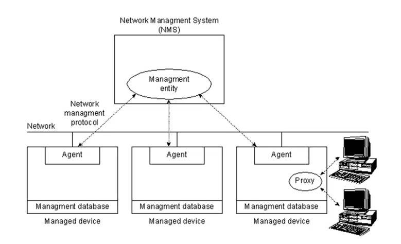

Основная задача, которая реализуется – задача управления конфигурацией.

### Управление конфигурацией:

1) Контролирование информации о сетевой и системной конфигурации.

2) Управление программными компонентами

3) Управление аппаратными компонентами

Реализация архитектуры в TCP/IP сделана с помощью протокола SNMP

## SNMP (Simple Network Management Protocol):

Первый стандарт 1988 г. Является основным протоколом управления в TCP/IP.

### Стандарты:

- RFC 1157
- RFC 1441-1450, RFC 1901-1910, RFC2263-2265, RFC 2273-2275, RFC 2573-2575
- RFC 3411 – 3418

### Существует три основных версии протокола: 

1) SNMPv1,

2) SNMPv2 (v2c, v2p,v2u – реализуют разные методы аутентификации) 

3) SNMPv3

Цель: хотим с помощью одного универсального протокола управлять разными устройствами: коммутаторы, маршрутизаторы, серверы, NAT серверы, web серверы, системы защиты информации и так далее. Поэтому необходимо общее представление управляющих команд.

Для этого была придумана общая среда – база управления MIB (management information database). Эта база представляет все задачи управления в виде дерева переменных, которые одинаковы для всех устройств, которые используются. Также SNMP устройства должны представлять информацию в виде этого дерева переменных. То есть SNMP агент на управляемых устройствах должен понимать это дерево переменных, и в таком виде отдавать данные SNMP менеджеру и отвечать в таком виде на запросы SNMP менеджера.

### Концепция переменных:

1) Операция чтения переменных

2) Операция записи переменной

3) Операция чтения следующей переменной (в случае если переменная списочная)

### Переменные:

1) Скалярные

2) Таблицы

## Протокол SNMP:

1) Независим от транспортного протокола, однако обычно используют UDP

2) На уровне представлений используется нотация ASN.1 Basic Encoding Rules, для кодирования сообщений для передачи по сети.

3) Порт управления – 161 (передача команд от менеджера к агенту)

4) Порт уведомлений (snmp trap(ловушки)) – 162 (сообщение менеджеру о чём-то, что произошло в управляемом устройстве)

5) Концепция «ловушек» - при нештатной ситуации менеджер оповещается об этом

### Часть дерева системы MIB

Используется не только для интернета, а во всех телекоммуникациях.

## Объект SNMP:

1) Текстовое имя

2) Тип объекта

   - Network address

   - IP address

   - Counter (счетчик со сбросом)

   - Gauge (счетчик без сброса)

   - Ticks (для измерения временных параметров

   - Opaque (строки)

3) Определение объекта

4) Доступ к объекту

   - Read-only

   - Write-only (для подачи управляющих команд)

   - Read-write

   - No-access

5) Статус

   - Обязательный (переменная должна быть реализована в любом устройстве) 

   - Необязательный

   - Устаревший

## Безопасность протокола SNMP:

1) Модель безопасности на основе сообществ 

   - Вводится понятие сообщества, нешифруемая строка, которая используется в запросе менеджеру, если строка совпадает, то можем подавать управляющие команды.

   - Используется:
     - SNMPv1
     - SNMPv2c

2) Модель безопасности на основе сторон
   - Вводится понятие стороны:
     - идентификатор стороны
     - логический сетевой адрес
     - протокол аутентификации и связанные параметры
     - протокол шифрования и связанные параметры
   - Используется:
     - SNMPv2p

3) Модель безопасности на основе пользователей

   - Вводится понятие пользователь
     - идентификатор пользователя
     - протокол аутентификации
     - протокол шифрования
     - ключи шифрования
     - ключи аутентификации

   - Используется:
     - SNMPv2u
     - SNMPv3 

# 49. Архитектура IPv6. Транспортный уровень, DNS, безопасность.

## Транспортный уровень

*(!TODO)*

**Протокол TCP** – 12-13 вопросы 

**Протокол UDP** – 11 вопрос 

**Протокол SCTP** – 14 вопрос

Транспортные механизмы в IPv6 не изменились – по-прежнему используются протоколы TCP, UDP, а также с самого начала IPv6 есть поддержка протокола SCTP. RFC 2960, RFC 3257.

## DNS

*(!TODO)*

**DNS** – 26-32 вопросы 

**DNS. Прямой поиск** – 27 вопрос 

**DNS. Обратный поиск** – 31 вопрос

- Для прямого преобразования добавлена одна ресурсная запись стандарта DNS, кроме записи `A` появилась запись `AAAA` (`A` - 32 разряда, а теперь 128 разрядов, т.е. 4*`A`, соответственно и длина адреса в 4 раза больше). Описано в RFC 1886.
- Обратное преобразование сделано также, как и в IPv4, через обратную зону, только теперь не через in-addr.arpa, а через ip6.arpa. Описано в RFC 3152.

## Безопасность

- Есть архитектура безопасности IPSEC, которая была разработана еще для IPv4 как внешнее дополнение. В IPv6 эта архитектура уже встроена.
- 2 протокола: Заголовок аутентификации AH и Заголовок шифрования ESP. Они по сути и реализуют эту архитектуру IPSEC, которая позволяет в двух режимах (транпортном и туннельном) обеспечивать полную защиту трафика, поэтому IPv6 изначально хорошо защищенная сеть.

# 50. Архитектура IPv6. Переход от IPv4 к IPv6.

Предпосылки развития связаны с недостатками протокола IPv4:

- Малое адресное пространство (32-битная адресация -> 232 = 4294967296 адресов)
- Неудобный формат адреса
- Сложная маршрутизация
- Низкая защищенность
  - Отсутствие шифрования
  - Отсутствие аутентификации
- Низкая эффективность передачи

## Сосуществование стеков

В 1995 году, когда вышел RFC на IPv6, было сказано, что в 2000 году IPv4 не останется, все перейдут на IPv6. Потом сказали, что к 2000 году не удалось, перейдем к 2005, потом к 2010, к 2015, к 2020. Сейчас есть оптимистичный прогноз на 2025 год, но в отличие от всех предыдущих случаев уже сейчас, примерно с 2015 года вся инфраструктура сети Интернет уже готова к переходу на IPv6, все маршрутизаторы поддерживают IPv6, все программные маршрутизаторы поддерживают, все ОС имеют стек протоколов IPv6. И сейчас вопрос перехода не технический, а организационный.

Как происходит сейчас переход на IPv6 (а уже существенная часть сети перешла на IPv6)? Есть несколько способов:

- **Двойные стеки протоколов:** компьютере поднимаются оба стека протоколов и часть приложений привязывается к стеку протоколов IPv4, а часть к IPv6)
- **Туннелирование:** вид маршрутизации, когда трафик одного типа запаковывается в трафик другого типа (используется в VPN). Островки сети IPv6 туннелируются сквозь сети IPv4 через программные туннели и для узлов IPv6 это прозрачно, потому что туннели — это прозрачная технология для прикладных программ.

- **Трансляция адресов:** когда пакет из сети IPv6 пришел на границу сети и дальше идут сети IPv4, то происходит трансляция одного адреса в другой.

 

 
